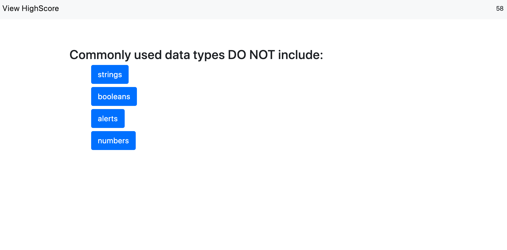

# code-quiz


## Summary 

The task in this project was to generate a quiz leveraging javascript to dynamically generate questions and answers located in an array and alter the html on the page. As well as store the answers along with the user information to local storage for later recal. 

## Site Picture 

  
 

## Technologies Used
- javascript - Used to dynamically change html and store user-input.
- Bootstrap - Used to pull existing html and CSS for creating     resposive organizational structer and styling for the site.
- HTML - used to create elements on the DOM
- CSS - styles html elements on page
- Git - version control system to track changes to source code
- GitHub - hosts repository that can be deployed to GitHub Pages
 


## Code Snippet

The bulk of this assigment was in generating the questions and answers to the page through the block of code listed figured bellow. Rendering the questions in the event listener listed below this section in the javascript file would then iterate through all the questions and dynamically insert a button corresponding to the answer in the same array as well as feature the bootstrap class placed on it.
```js
function renderqa() {
  questionsEl.innerHTML = "";
  answersEl.innerHTML = "";

  questionsEl.textContent = questions[qCount].title;

  for (var i = 0; i < questions[qCount].choices.length; i++) {
    var li = document.createElement("li");
    li.innerHTML = "<button class='btn-primary btn-lg mb-2'>" + questions[qCount].choices[i] + "</button>";
    answersEl.appendChild(li);

  }
```


## Built With

* [HTML](https://developer.mozilla.org/en-US/docs/Web/HTML)
* [CSS](https://developer.mozilla.org/en-US/docs/Web/CSS)
* [Boostrap](https://getbootstrap.com/)

## Authors

**Chris Melby** 

- [Link to Portfolio Site](#)
- [Link to Github](https://github.com/cmelby)
- [Link to LinkedIn](https://www.linkedin.com/in/chris-melby-71106b126/)